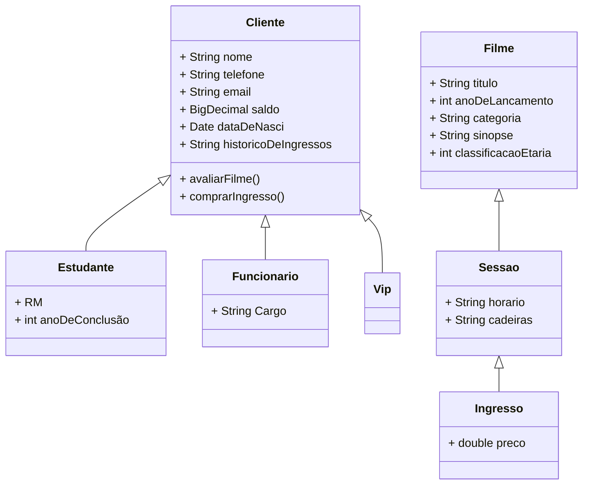

# Agenda de Contatos

Este projeto consiste em uma aplicação de agenda de contatos desenvolvida em Java utilizando o IntelliJ IDEA. A agenda permite o registro, visualização, edição e remoção de contatos, seguindo as regras de negócio estabelecidas.

##




## Perguntas sobre o processo do projeto

1. Quais foram os desafios no projeto?
   - Versionamento em grupo com git;
   - Duvidas sobre como enfrentar o método Editar.

2. O que foi mais interessante?
    - O projeto como todo foi interessante por causa das restrições que nos levou a gente pensar fora da caixa.

3. O que pode ser melhorado?
    - A validação dos inputs;
    - Implementação de persistência.

## Funcionalidades

- **Adicionar Contato:** Permite adicionar um novo contato com nome, telefone e e-mail.
- **Detalhar Contato:** Exibe as informações completas de um contato, filtrando pelo número de telefone.
- **Editar Contato:** Permite a edição dos dados de um contato existente, identificado pelo telefone.
- **Remover Contato:** Remove um contato da agenda utilizando o número de telefone como referência.
- **Listar Contatos:** Exibe a lista de todos os contatos cadastrados na agenda.

## Estrutura do Projeto

A aplicação foi organizada da seguinte forma:
- `src/`: Contém os arquivos de código-fonte em Java.
  - `Agenda.java`:Ponto entrada da aplicação
- `README.md`: Arquivo de documentação do projeto.

## Requisitos para Execução

- Java 7 ou superior
- IntelliJ IDEA ou outro IDE para Java
- Git para controle de versão

## Como Executar

1. Clone o repositório:
   ```bash
   git clone https://github.com/EyzRyder/agenda-de-contatos.git
   ```
2. Abra o projeto no IntelliJ IDEA.
3. Execute a classe Agenda.java para iniciar a aplicação.

